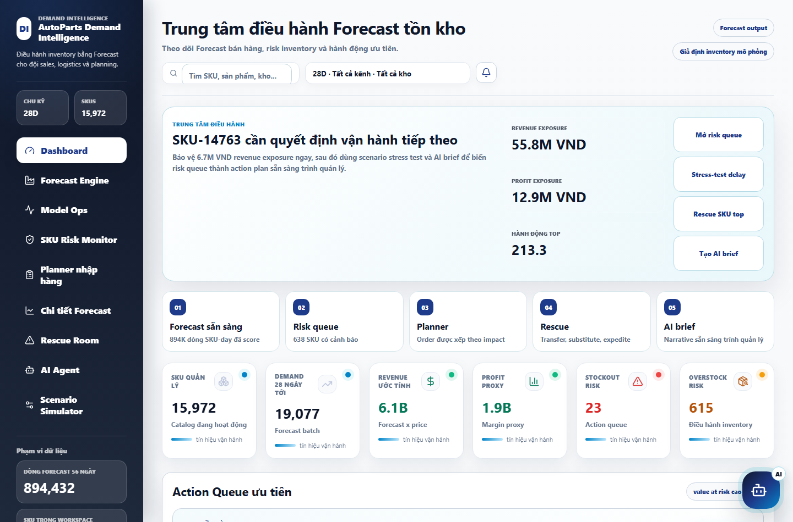
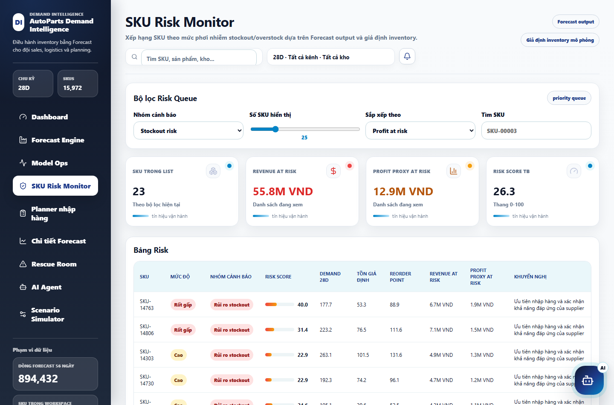
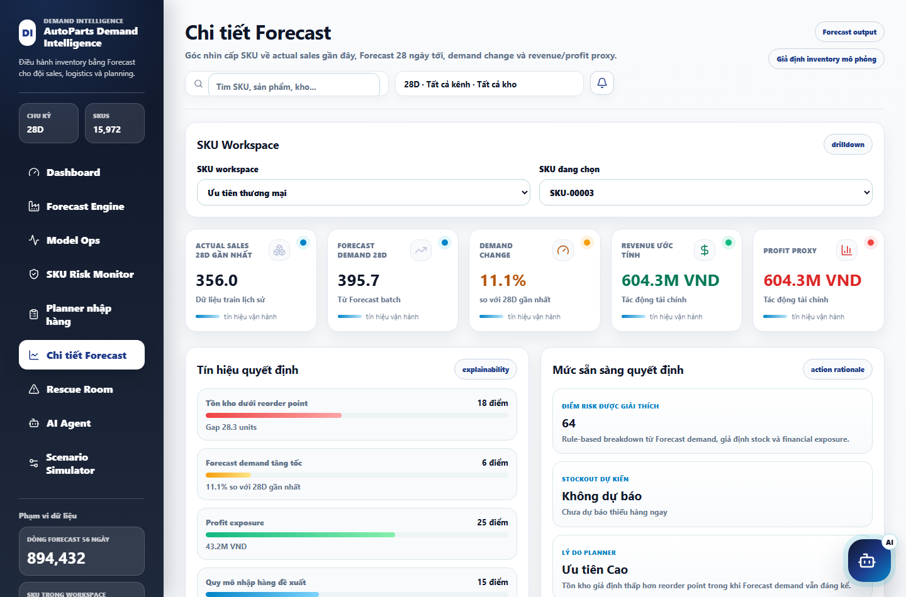
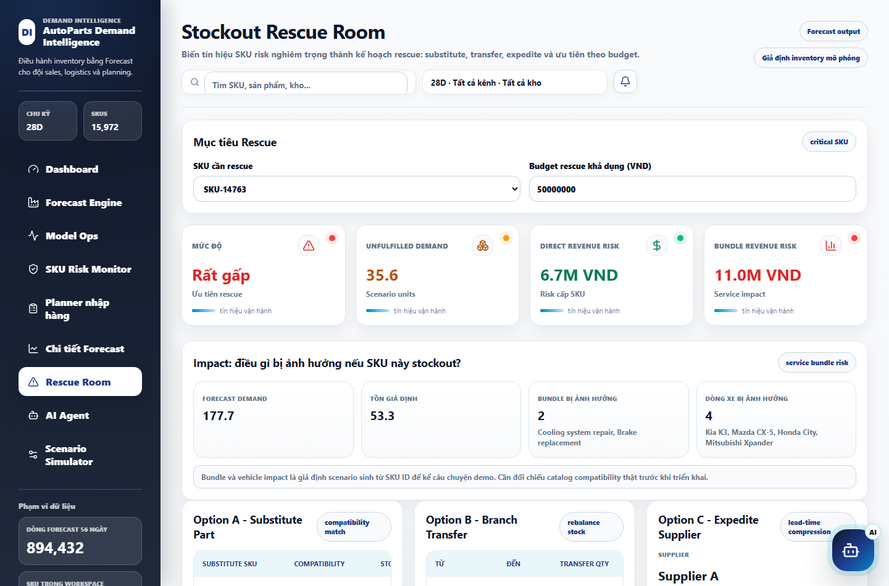
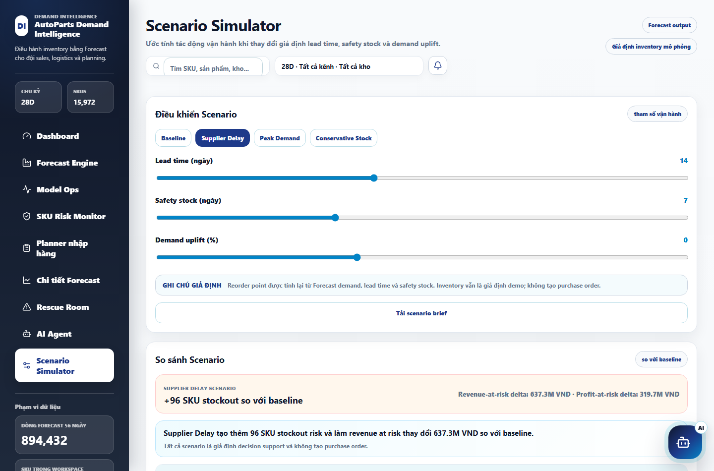
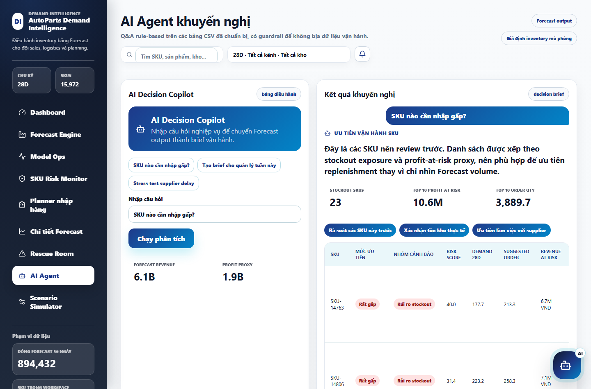

# Script demo HBAAC_2026 cho ban giám khảo

Mục tiêu khi demo: không trình bày như một dashboard rời rạc. Hãy kể câu chuyện sản phẩm theo luồng:

**Forecast -> Risk -> Scenario -> Rescue -> AI brief -> quyết định vận hành**

Thông điệp chính cần lặp lại trong suốt phần demo:

> Sản phẩm không chỉ dự báo nhu cầu. Sản phẩm biến Forecast thành quyết định nhập hàng, cảnh báo stockout/overstock, stress test scenario và action plan có thể trình quản lý.

Thời lượng khuyến nghị: **8-10 phút**.

Link demo local khi luyện tập: `http://127.0.0.1:5174/#dashboard`

Nếu demo bằng Vercel: dùng route tương ứng như `https://hbaac-2026.vercel.app/#dashboard`.

---

## 0. Mở đầu 20-30 giây

**Màn hình:** `#dashboard`



**Bạn nói:**

> Kính chào ban giám khảo. Sản phẩm của nhóm em là **AutoParts Demand Intelligence**, một hệ thống hỗ trợ ra quyết định cho inventory, logistics và sales trong ngành phụ tùng ô tô.
>
> Điểm nhóm em muốn giải quyết không chỉ là bài toán "dự báo bán được bao nhiêu", mà là bài toán vận hành phía sau: SKU nào có nguy cơ stockout, SKU nào overstock, tác động revenue/profit là bao nhiêu, và nên hành động thế nào ngay hôm nay.
>
> Vì vậy demo của nhóm em đi theo một workflow end-to-end: **Forecast -> Risk Monitor -> Scenario Simulator -> Rescue Room -> AI Agent brief**.

**Nhấn mạnh với BGK:**

- Đây là demo sản phẩm dữ liệu, không chỉ là bài notebook/model.
- Mọi phần đều phục vụ quyết định vận hành.
- Các thuật ngữ như `Forecast`, `SKU`, `stockout`, `overstock`, `lead time`, `safety stock`, `profit proxy` được giữ lại vì đây là thuật ngữ nghiệp vụ/kỹ thuật.

---

## 1. Dashboard - Trung tâm điều hành

**Route:** `#dashboard`


**Mục tiêu phần này:** làm BGK hiểu ngay trong 10 giây sản phẩm đang giúp quản lý trả lời câu hỏi gì.

**Thao tác trên web:**

1. Chỉ vào tiêu đề **Trung tâm điều hành Forecast tồn kho**.
2. Chỉ vào khối command brief lớn ở đầu trang.
3. Chỉ vào các nút CTA: `Mở risk queue`, `Stress-test delay`, `Rescue SKU top`, `Tạo AI brief`.
4. Chỉ xuống dãy KPI ngay dưới command brief để cho thấy quy mô SKU, demand, revenue/profit và số cảnh báo.

**Bạn nói:**

> Đây là màn hình đầu tiên dành cho quản lý. Thay vì bắt người dùng đọc hàng nghìn dòng Forecast, hệ thống tự rút ra SKU cần quyết định tiếp theo.
>
> Ở đây ban giám khảo có thể thấy SKU ưu tiên, revenue exposure, profit exposure và hành động đề xuất. Các nút bên phải đưa thẳng người dùng vào workflow tiếp theo: mở risk queue, stress test supplier delay, rescue SKU hoặc tạo AI brief.
>
> Phía dưới là các KPI vận hành chính: tổng SKU quản lý, demand 28 ngày tới, revenue/profit proxy và số SKU đang có stockout/overstock risk. Nhìn vào đây quản lý có thể hiểu quy mô bài toán trước khi đi sâu vào từng SKU.

**Câu chốt gây ấn tượng:**

> Dashboard này không chỉ trả lời "chuyện gì đang xảy ra", mà trả lời luôn "nên làm gì tiếp theo".

**Điểm nhấn nên diễn thật chậm tại đây:**

> Ví dụ ngay trên màn hình này, hệ thống đang đẩy `SKU-14763` lên đầu command brief. Nếu chỉ nhìn bảng Forecast thường, SKU này rất dễ bị chìm trong hàng nghìn dòng dữ liệu.
>
> Nhưng ở đây hệ thống nói rõ: đây là SKU có `stockout risk`, suggested order khoảng **213 units**, revenue at risk khoảng **6.7M VND** và profit at risk khoảng **1.9M VND**. Tức là sản phẩm không chỉ báo "có rủi ro", mà lượng hóa luôn rủi ro đó thành tiền và action.

**Cách minh họa trên web:**

1. Dừng 2 giây ở command brief đầu trang.
2. Trỏ vào `SKU-14763 cần quyết định vận hành tiếp theo`.
3. Trỏ tiếp xuống dòng đầu tiên trong `Action Queue ưu tiên`.
4. Nói câu chốt:

> Đây là khoảnh khắc dữ liệu biến thành quyết định: từ một SKU bị chìm trong dataset, hệ thống kéo nó lên thành việc cần xử lý ngay.

**Nếu BGK hỏi "vì sao cần phần này?":**

> Nếu chỉ có Forecast, người dùng vẫn phải tự phân tích. Command center giúp rút ngắn thời gian từ dữ liệu sang quyết định, đặc biệt khi có hàng nghìn SKU.

---

## 2. SKU Risk Monitor - Ưu tiên theo business impact

**Route:** `#risk`



**Mục tiêu phần này:** chứng minh hệ thống biết ưu tiên SKU nào trước, không chỉ liệt kê dữ liệu.

**Thao tác trên web:**

1. Bấm `SKU Risk Monitor`.
2. Chọn nhóm cảnh báo `Stockout risk` nếu cần.
3. Sắp xếp theo `Profit at risk` hoặc `Revenue at risk`.
4. Click một SKU top risk để mở chi tiết.

**Bạn nói:**

> Sau khi có Forecast, bước tiếp theo là chuyển sang risk. Ở đây mỗi SKU được đánh giá theo stockout risk hoặc overstock risk, kèm risk score, Forecast demand 28D, revenue at risk và profit at risk.
>
> Trong vận hành thực tế, SKU bán nhiều chưa chắc là SKU cần xử lý trước. SKU cần xử lý trước là SKU có rủi ro cao và impact kinh doanh lớn.
>
> Vì vậy bảng này giúp planner ưu tiên công việc theo business impact thay vì cảm tính.

**Câu chốt:**

> Risk Monitor giúp trả lời: "Nếu hôm nay chỉ xử lý được 10 SKU, nên xử lý SKU nào trước?"

**Nếu BGK hỏi "risk score tính thế nào?":**

> Risk score trong demo là rule-based layer dựa trên Forecast demand, tồn kho giả định, reorder point, demand change và financial exposure. Mục tiêu là tạo tín hiệu ưu tiên dễ giải thích cho planner.

---

## 3. Forecast Detail - Giải thích vì sao SKU rủi ro

**Route:** `#detail`



**Mục tiêu phần này:** cho thấy recommendation có giải thích, không phải black box.

**Thao tác trên web:**

1. Mở một SKU từ Risk Monitor hoặc dùng `Chi tiết Forecast`.
2. Chỉ vào phần `Vì sao SKU này rủi ro?`.
3. Chỉ vào các driver: reorder gap, Forecast demand, profit exposure.
4. Chỉ vào chart Forecast tương lai.
5. Chỉ vào nút `Rescue SKU này`.

**Bạn nói:**

> Khi click vào một SKU, hệ thống đi sâu vào giải thích. Ở đây người dùng thấy Forecast demand 28D, demand change, revenue/profit proxy, và các risk driver.
>
> Phần quan trọng là recommendation có thể giải thích được: tồn kho giả định có thấp hơn reorder point không, Forecast demand có tăng không, profit exposure có đủ lớn không.
>
> Điều này giúp planner không chỉ nhận một cảnh báo, mà hiểu vì sao hệ thống đề xuất hành động.

**Câu chốt:**

> Đây là lớp explainability để quản lý tin được recommendation và biết cần kiểm tra dữ kiện nào trước khi duyệt.

**Nếu BGK hỏi "vì sao cần drilldown?":**

> Vì quản lý cần tổng quan, nhưng planner cần chi tiết để hành động. Drilldown giúp chuyển từ executive view sang operational view.

---

## 4. Stockout Rescue Room - Từ cảnh báo sang kế hoạch xử lý

**Route:** `#rescue`



**Mục tiêu phần này:** đây là phần "wow" nhất. Cho thấy hệ thống không chỉ cảnh báo mà còn đề xuất action plan.

**Thao tác trên web:**

1. Bấm `Rescue Room` hoặc từ Forecast Detail bấm `Rescue SKU này`.
2. Chỉ các KPI: mức độ, unfulfilled demand, direct revenue risk, bundle revenue risk.
3. Chỉ 3 option:
   - `Option A - Substitute Part`
   - `Option B - Branch Transfer`
   - `Option C - Expedite Supplier`
4. Chỉ `Budget Optimizer`.
5. Bấm `Tạo manager brief` hoặc `Tạo supplier email` nếu muốn demo export.

**Bạn nói:**

> Đây là phần nhóm em muốn tạo khác biệt. Nếu một SKU có nguy cơ stockout, hệ thống không chỉ báo đỏ rồi dừng lại. Nó mở một **Stockout Rescue Room**.
>
> Rescue Room mô phỏng các phương án hành động: substitute part nếu có SKU thay thế, branch transfer nếu chi nhánh khác còn hàng, expedite supplier nếu cần nén lead time, hoặc partial reorder.
>
> Mỗi action có cost proxy, revenue protected và decision score. Budget Optimizer giúp chọn tổ hợp hành động phù hợp với ngân sách rescue.

**Điểm nhấn nên diễn như một câu chuyện "trước - sau":**

> Lúc nãy ở Dashboard, `SKU-14763` chỉ là một cảnh báo stockout. Bây giờ khi vào Rescue Room, cảnh báo đó đã biến thành các lựa chọn hành động cụ thể.
>
> Nếu em là planner, em không cần hỏi "giờ làm gì tiếp?". Màn hình này đã gợi ý: có thể substitute part, chuyển hàng từ chi nhánh khác, hoặc expedite supplier. Mỗi lựa chọn đều có cost proxy và revenue protected để so sánh.

**Cách minh họa trên web:**

1. Chỉ vào `Direct Revenue Risk` và `Bundle Revenue Risk`.
2. Chỉ lần lượt `Option A`, `Option B`, `Option C`.
3. Chỉ `Budget Optimizer`.
4. Nói câu chốt:

> Điểm em muốn BGK nhớ là: hệ thống không dừng ở cảnh báo đỏ. Nó đưa người dùng đến bàn điều phối hành động.

**Câu chốt:**

> Đây là nơi Forecast thật sự biến thành operation plan: chuyển hàng từ đâu, thay bằng SKU nào, liên hệ supplier nào, và bảo vệ được bao nhiêu revenue.

**Nếu BGK hỏi "các option này có phải dữ liệu thật không?":**

> Trong demo, substitute compatibility, branch stock và supplier lead time là scenario assumption vì dataset chưa có catalog/kho/supplier live. Nhưng workflow đã mô phỏng đúng cách một doanh nghiệp sẽ vận hành khi có dữ liệu thật.

---

## 5. Scenario Simulator - Stress test trước khi quyết định

**Route:** `#scenario`



**Mục tiêu phần này:** cho thấy sản phẩm hỗ trợ ra quyết định trong điều kiện bất định.

**Thao tác trên web:**

1. Bấm `Scenario Simulator`.
2. Bấm preset `Supplier Delay`.
3. Bấm preset `Peak Demand`.
4. Kéo slider `Lead time`, `Safety stock`, `Demand uplift`.
5. Chỉ impact banner, KPI delta và bảng scenario.
6. Bấm `Tải scenario brief` nếu cần.

**Bạn nói:**

> Trong thực tế, kế hoạch nhập hàng không cố định. Nếu supplier delay thêm vài ngày, hoặc demand tăng do mùa cao điểm, risk có thể thay đổi rất nhanh.
>
> Scenario Simulator cho phép planner stress test các giả định như lead time, safety stock và demand uplift. Mỗi lần thay đổi, hệ thống tính lại số SKU stockout, SKU overstock, revenue at risk và profit at risk.
>
> Điều này giúp đội vận hành không chỉ nhìn trạng thái hiện tại, mà còn chuẩn bị trước cho tình huống xấu.

**Câu chốt:**

> Scenario Simulator trả lời câu hỏi: "Nếu ngày mai supplier chậm hơn hoặc demand tăng mạnh, kế hoạch hiện tại còn an toàn không?"

**Nếu BGK hỏi "tại sao cần scenario?":**

> Vì Forecast là một dự báo, nhưng vận hành luôn có bất định. Scenario giúp biến một con số Forecast thành nhiều phương án ra quyết định.

---

## 6. AI Agent - Truy vấn dữ liệu bằng ngôn ngữ tự nhiên

**Route:** `#agent`



**Prompt nên dùng khi demo:**

```text
SKU nào cần nhập gấp?
```

Prompt thứ hai nếu còn thời gian:

```text
Tạo brief cho quản lý tuần này
```

Prompt thứ ba nếu BGK hỏi về scenario:

```text
Stress test supplier delay
```

**Mục tiêu phần này:** cho thấy sản phẩm dễ dùng với quản lý/người vận hành không muốn tự lọc bảng.

**Thao tác trên web:**

1. Bấm `AI Agent`.
2. Nhập `SKU nào cần nhập gấp?`.
3. Chỉ summary tiếng Việt.
4. Chỉ metrics.
5. Chỉ action chips.
6. Chỉ bảng SKU bên dưới.

**Bạn nói:**

> Cuối cùng là AI Agent. Agent này không trả lời tự do ngoài dữ liệu, mà chỉ dựa trên Forecast table và risk table đã nạp.
>
> Ví dụ em hỏi "SKU nào cần nhập gấp?", agent trả lời bằng tiếng Việt, đưa ra danh sách SKU ưu tiên, metric liên quan và action đề xuất.
>
> Lớp này giúp quản lý hoặc nhân viên vận hành không cần tự lọc nhiều bảng, mà có thể hỏi trực tiếp bằng ngôn ngữ tự nhiên.

**Câu chốt:**

> AI Agent ở đây không thay thế planner. Nó giúp planner ra quyết định nhanh hơn, có cấu trúc hơn và dễ trình bày hơn với quản lý.

**Nếu BGK hỏi "AI có bịa không?":**

> Không. Trong demo này agent bị giới hạn vào dữ liệu đã nạp: Forecast table, risk table và scenario logic. Với live inventory, supplier commitment hoặc purchase order thật, hệ thống luôn yêu cầu xác thực ngoài demo.

---

## 7. Kết luận 30-45 giây

**Màn hình nên quay lại:** `#dashboard`

**Bạn nói:**

> Tóm lại, sản phẩm của nhóm em là một workflow end-to-end cho văn hóa sử dụng dữ liệu trong vận hành phụ tùng ô tô.
>
> Điểm khác biệt là Forecast không đứng một mình. Forecast được chuyển thành risk monitor, planner queue, scenario stress test, rescue plan và AI brief.
>
> Trong phạm vi cuộc thi, dữ liệu inventory và supplier là scenario assumption có guardrail rõ ràng. Nếu triển khai thực tế, phần này có thể thay bằng ERP/WMS và supplier data live.
>
> Giá trị cốt lõi của sản phẩm là giúp doanh nghiệp nhìn thấy rủi ro sớm, hiểu tác động revenue/profit, và hành động trước khi stockout xảy ra.

**Câu cuối thật mạnh:**

> Nói ngắn gọn: nhóm em không chỉ xây một dashboard dự báo, mà xây một hệ thống biến Forecast thành quyết định vận hành.

---

## Bản demo rút gọn 5 phút

Nếu BGK giới hạn thời gian, đi theo luồng này:

1. `Dashboard`: nói 45 giây về command center và workflow end-to-end.
2. `Risk Monitor`: nói 45 giây về ưu tiên SKU theo business impact.
3. `Forecast Detail`: nói 45 giây về explainability.
4. `Rescue Room`: nói 90 giây, đây là phần wow nhất.
5. `Scenario Simulator`: nói 45 giây về stress test supplier delay.
6. `AI Agent`: nói 60 giây, nhập prompt `SKU nào cần nhập gấp?`.
7. Kết luận 30 giây.

Nếu chỉ có 5 phút, giữ đúng luồng action: `Dashboard -> Risk Monitor -> Forecast Detail -> Rescue Room -> Scenario Simulator -> AI Agent`.

---

## Những câu nên dùng nhiều lần

- "Không chỉ dự báo, mà biến Forecast thành quyết định."
- "Ưu tiên theo business impact, không chỉ theo volume."
- "Forecast output đi tiếp vào Risk, Scenario, Rescue và AI brief."
- "Inventory và supplier trong demo là scenario assumption, không claim dữ liệu ERP/WMS live."
- "AI Agent chỉ trả lời từ dữ liệu đã nạp, không bịa dữ kiện vận hành."

---

## Những câu nên tránh

- Không nói: "Hệ thống đã tích hợp ERP/WMS live."
- Không nói: "AI tự động quyết định mua hàng."
- Không nói: "Stockout chắc chắn xảy ra."
- Nên nói: "Hệ thống phát hiện risk và tạo decision support; planner vẫn xác thực trước khi hành động."

---

## Q&A nhanh cho BGK

**Hỏi:** Dữ liệu inventory có thật không?

**Trả lời:** Trong demo, inventory là scenario assumption vì dataset cuộc thi không cung cấp ERP/WMS live. Nhóm em ghi rõ guardrail trong các note của dashboard, scenario, rescue và AI Agent. Khi triển khai thật, phần assumption này có thể thay bằng dữ liệu tồn kho live.

**Hỏi:** Vì sao cần AI Agent nếu đã có dashboard?

**Trả lời:** Dashboard tốt cho scanning, còn AI Agent tốt cho truy vấn tự nhiên và tạo brief. Quản lý có thể hỏi "SKU nào cần nhập gấp?" hoặc "Tạo brief tuần này" mà không cần tự lọc bảng.

**Hỏi:** Model có phải điểm chính không?

**Trả lời:** Model là nền tảng, nhưng giá trị sản phẩm nằm ở việc đưa Forecast vào workflow ra quyết định: risk queue, scenario stress test, rescue action và brief cho quản lý.

**Hỏi:** Nếu Forecast sai thì sao?

**Trả lời:** Hệ thống không phụ thuộc vào một con số Forecast duy nhất. Risk Monitor giúp ưu tiên SKU theo business impact, Forecast Detail cho explainability, còn Scenario Simulator giúp test nhiều giả định như lead time, safety stock và demand uplift trước khi chốt hành động.

**Hỏi:** Phần Rescue Room có triển khai thật được không?

**Trả lời:** Có, nếu doanh nghiệp có catalog compatibility, branch stock và supplier lead time thật. Trong demo, nhóm em mô phỏng workflow để chứng minh cách sản phẩm sẽ biến risk thành action plan.
